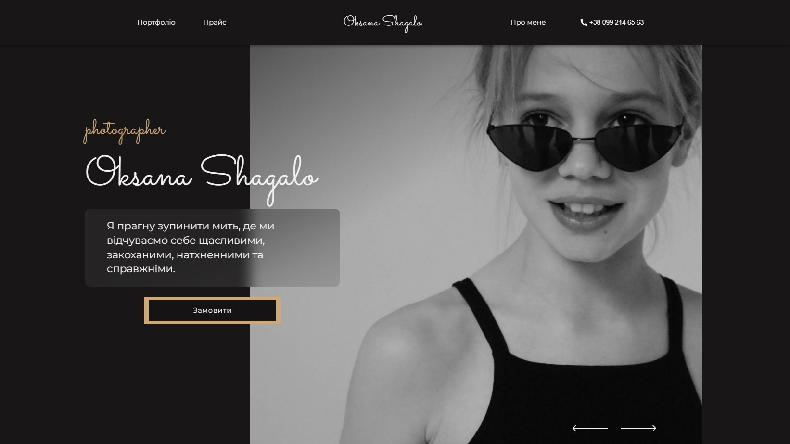

Замовник та Технології:

- Проект реалізовано на замовлення починаючого фотографа.

- Використані технології: Parcel, SASS, JS, npm.

Використані Практики та Засоби:

- Семантична розмітка для покращення доступності та SEO.

- Методологія БЕМ для структурування та організації коду.

- Адаптивний дизайн для оптимального відображення на різних пристроях.

- Використання ARIA для покращення доступності веб-додатка.

Реалізовані Функціональності:

- Повноекранна секція герой з анімованим слайдером та розміщеними зображеннями в
  окремих класах для фону.

- Меню-бургер з цікавою анімацією.

- Плавний скрол до розділів з використанням меню навігації.

- Галерея з розділами, використанням Masonry розмітки та слайдером
  SimpleLightbox.

- Форма з мінімальною JS валідацією, нотифікацією про помилки/підтвердження та
  можливістю відправки даних в телеграм.

